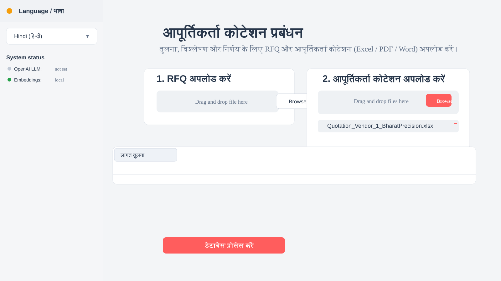
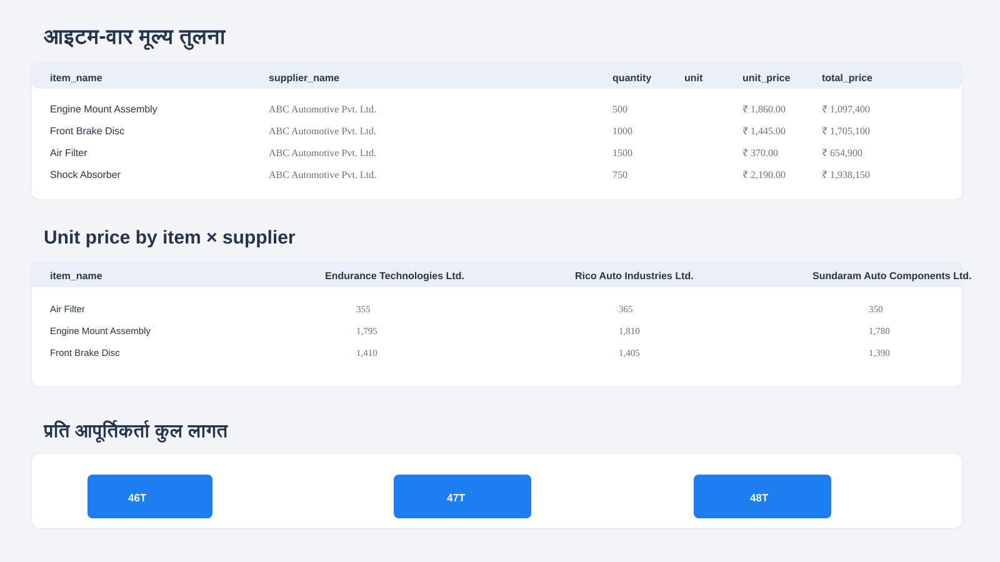
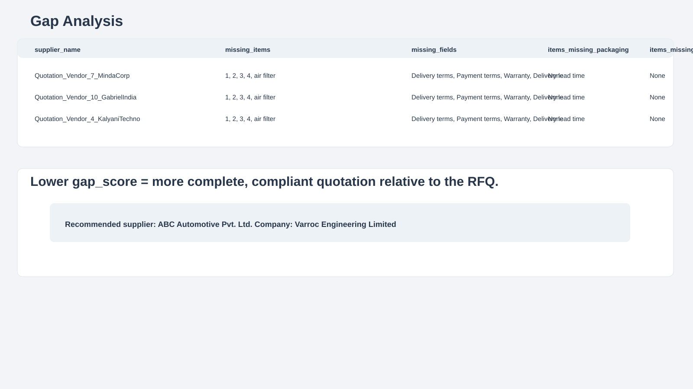
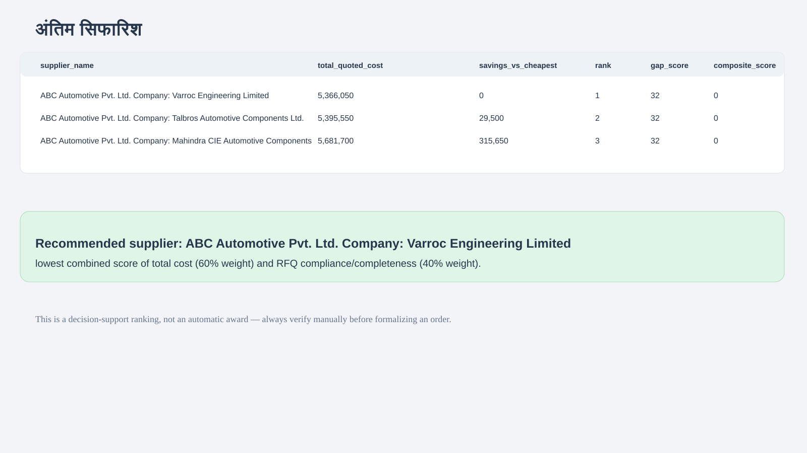

# Supplier Quotation Management

Procurement dashboard to compare RFQs with supplier quotations, detect gaps, estimate pricing, and draft supplier communication.

Built with Streamlit, Pandas, FAISS, and optional OpenAI.

## Overview

This app helps procurement teams:

- upload one RFQ and multiple quotations
- parse Excel, PDF, and Word files
- extract structured fields like supplier, item list, quantities, unit price, terms, and warranty
- compare suppliers item-wise and total cost-wise
- flag missing RFQ requirements
- estimate upfront payment from payment terms
- ask questions over the indexed documents
- generate email drafts in English or Hindi

## Real app flow

1. Upload RFQ
2. Upload supplier quotes
3. Click Process documents
4. System parses and normalizes each file
5. Calculates item-wise comparison and total cost
6. Checks RFQ compliance and gap score
7. Builds FAISS vector index for search/Q&A
8. Shows final recommendation and email draft

## Screenshots

### Upload screen



### Cost comparison



### Gap analysis



### Final recommendation



## Project structure

- app.py — main Streamlit dashboard
- config.py — environment and settings
- src/parsers — Excel/PDF/Word parsing
- src/extraction — structured extraction logic
- src/analysis — cost, gap, and investment calculations
- src/vectorstore — FAISS indexing
- src/chatbot — Q&A over indexed documents
- src/mailer — email drafting and SMTP sending
- src/storage — local/Azure storage abstraction
- sample_data — demo RFQ and quotations

## Without API

The app still works without OpenAI.

It uses:

- local parsers for Excel/PDF/Word
- heuristic extraction from tables and key-value fields
- Pandas calculations for totals and gaps
- local FAISS embeddings for retrieval

## With API

If `OPENAI_API_KEY` is configured, it improves:

- extraction quality for messy PDFs and mixed-language docs
- natural-language answers in English/Hindi
- better AI-based structured parsing

## Calculation logic

### Total cost

For each supplier:

- sum item `total_price`
- rank suppliers by total quoted cost

### Gap score

The app compares RFQ required items with supplier quote items and adds penalty points for:

- missing items
- missing fields
- missing packaging or portion info

Lower `gap_score` = better compliance.

### Final ranking

Final recommendation uses:

- 60% total cost
- 40% RFQ compliance

This is a decision-support ranking, not an automatic award.

## Email and multilingual support

- English and Hindi UI
- English/Hindi email drafting
- real email sending only when SMTP credentials are configured

## Contributor / ownership

Owner and maintainer:

- Harshit Gautam

Language used in the app UI and sample communication:

- English
- Hindi (हिन्दी)
- mixed bilingual workflow support

## Setup

```bash
python -m venv venv
source venv/bin/activate   # Windows: venv\Scripts\activate
pip install -r requirements.txt
streamlit run app.py
```

Optional demo generation:

```bash
python sample_data/generate_sample_data.py
```

## Notes

- Works out of the box without API keys
- Best accuracy on structured Excel/Word tables
- AI mode is recommended for messy PDFs and mixed-language documents

---

## License

This project is maintained by Harshit Gautam.

### Local / no-key mode

This works without any external credential.

Features available:

- upload files
- parse Excel, PDF, Word
- extract fields using structured heuristics
- compare supplier pricing
- compute totals and gap analysis
- estimate investment/cash outflow
- create local FAISS index
- ask questions against indexed documents
- draft emails in English and Hindi

Important note:

- no real email sending unless SMTP credentials are configured
- no AI-generated natural-language summary unless OpenAI is configured

### AI mode

When `OPENAI_API_KEY` is configured:

- extraction uses GPT JSON generation
- the query bot generates natural-language answers
- text is still grounded in the retrieved document chunks
- multimodal and mixed-language document handling becomes more robust

Other optional upgrades include:

- OpenAI embeddings via `EMBEDDINGS_MODE=openai`
- Azure Blob + Cosmos storage
- LlamaParse for better PDF parsing
- real SMTP email sending

---

## 7. Data flow, end-to-end

A typical run looks like this:

1. User uploads RFQ and quotations
2. [app.py](app.py) calls `save_uploaded_file()`
3. Files are stored under `data/uploads`
4. `parse_document()` chooses parser by extension
5. Raw text + tables are extracted
6. `extract_structured_data()` normalizes the document into procurement fields
7. The RFQ and quotations are saved as records in the local database JSON
8. The app builds item-wise and total-cost comparison tables
9. It compares RFQ requirements against each supplier quote
10. It stores the parsed text in a FAISS vector index
11. The chat Q&A agent can search this index
12. The dashboard renders charts, tables, and recommendation summaries
13. Optionally it generates emails for gap follow-up or award notification

---

## 8. How calculation logic works

### 8.1 Total cost per supplier

The app groups all item totals by supplier name:

- supplier_name
- total_quoted_cost = sum of all quoted item totals

This is computed in [src/analysis/cost_comparison.py](src/analysis/cost_comparison.py).

### 8.2 Cheapest supplier per item

For each item, the app selects the supplier with the minimum unit price:

- item_name
- supplier_name
- best_unit_price

### 8.3 Gap score

Gap score is a weighted comparison between required RFQ items and supplier responses.

The formula is essentially:

- missing items × 3
- missing required fields
- missing packaging records
- missing portion details

This creates a simple numeric compliance ranking.

### 8.4 Final recommendation

The final summary tab uses a composite score:

- 60% weight on cost
- 40% weight on gap/compliance

This is meant as decision support, not a final award decision.

---

## 9. Storage and persistence

The project stores documents in the local `data/` folder by default:

- `data/uploads` - raw uploaded files
- `data/processed` - processed data/output area
- `data/vector_index` - FAISS index
- `data/db/records.json` - local record metadata store

This is configured in [config.py](config.py).

The code supports an Azure upgrade path via [src/storage/azure_storage.py](src/storage/azure_storage.py), but the default is local storage for zero-setup operation.

---

## 10. Email system

The email module [src/mailer/email_sender.py](src/mailer/email_sender.py) can:

- build a missing-information request email
- build an award notification email
- send via SMTP if configured
- otherwise return a draft instead of sending

It supports both English and Hindi content.

This is useful because after gap analysis, the user may want to ask a supplier to provide missing documentation or confirm an item.

---

## 11. Sample data

The project includes sample demo files in [sample_data/generate_sample_data.py](sample_data/generate_sample_data.py).

Running this script creates:

- sample RFQ Excel file
- sample supplier quotation Excel file
- sample supplier quotation Word file
- sample supplier quotation PDF file

This allows the app to be tested immediately without preparing actual procurement data.

---

## 12. Setup and run

### Prerequisites

- Python 3.10+
- pip

### Install dependencies

```bash
python -m venv venv
source venv/bin/activate      # Windows: venv\Scripts\activate
pip install -r requirements.txt
```

### Optional demo data

```bash
python sample_data/generate_sample_data.py
```

### Optional environment setup

```bash
cp .env.example .env
```

Then edit `.env` for optional configuration such as:

- `OPENAI_API_KEY`
- `SMTP_USERNAME` / `SMTP_PASSWORD`
- `STORAGE_BACKEND`
- `AZURE_*` values
- `LLAMA_CLOUD_API_KEY` for optional cloud parsing

### Run the app

```bash
streamlit run app.py
```

Then open the local Streamlit URL and upload the sample RFQ + supplier quotations.

---

## 13. Dependencies used in the project

From [requirements.txt](requirements.txt), the app relies on libraries such as:

- Streamlit for the dashboard UI
- pandas for tabular analysis
- openpyxl for Excel parsing
- python-docx for Word files
- pdfplumber for PDF extraction
- langchain and FAISS for vector search
- sentence-transformers for local embeddings
- openai for optional AI features
- plotly for charts

This gives the project a practical AI + analytics stack without requiring a heavy backend.

---

## 14. Important design principles

### Modular design

Each concern has a dedicated module:

- parsing
- extraction
- analysis
- storage
- vector retrieval
- email generation
- UI

This keeps the code easier to maintain and extend.

### No-API-safe by default

The project is intentionally designed to work even if no API key is set.

This makes it useful for demos, local testing, and environments where users do not want cloud dependencies.

### AI upgrade path

The code is structured so the system can upgrade later without rewriting the whole app:

- switch extraction to GPT
- switch embeddings to OpenAI
- switch storage to Azure
- enable real SMTP sending

---

## 15. Best practices and limitations

### Strengths

- Works immediately with local files
- Handles common procurement document layouts
- Good for side-by-side negotiation comparisons
- Useful for internal decision support
- Works in English/Hindi UI and some multilingual document support

### Limitations

- Heuristic extraction may miss unusual layouts or unstructured PDFs
- OCR-like or highly noisy documents may need AI extraction for better accuracy
- Final recommendation should still be reviewed by a human before approving a supplier
- Payment questions or ambiguous terms are left blank rather than guessed when unclear

---

## 16. Summary

This system is a complete RFQ-to-quotation decision support tool in one Streamlit app.

It does the following:

- accepts procurement docs
- parses them reliably
- extracts structured data
- compares prices across suppliers
- checks compliance against the RFQ
- estimates cash outlay and advance payment needs
- answers questions using the indexed documents
- supports bilingual workflow and email drafting

In short, it helps procurement teams move from messy supplier documents to a structured, comparable, and decision-ready view.

---

## 17. Quick start checklist

1. Create virtual environment
2. Install dependencies
3. Generate sample data (optional)
4. Run `streamlit run app.py`
5. Upload an RFQ and quotations
6. Click Process documents
7. Review cost comparison, gap analysis, investment, chatbot, and email tabs
8. Add OpenAI / SMTP / Azure only when needed for stronger features

This project is built to be practical, transparent, and usable without any cloud setup, while still allowing advanced AI features when the user adds API keys.
